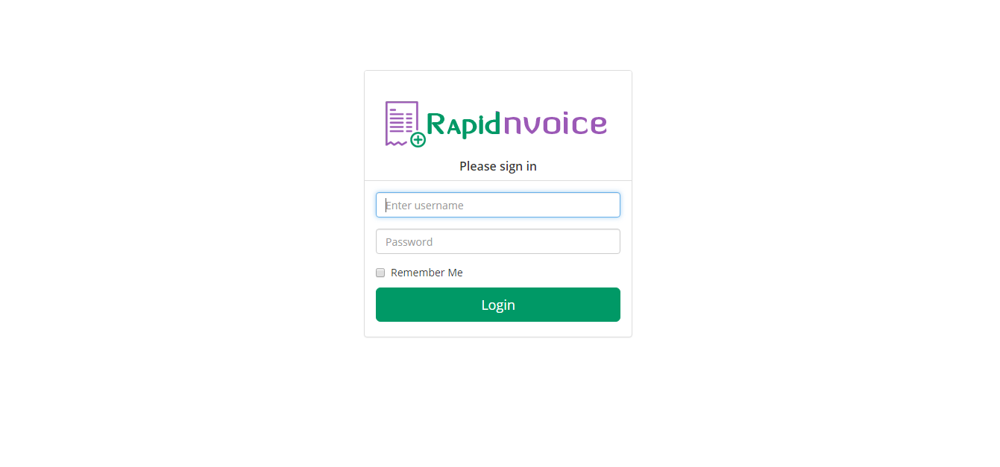
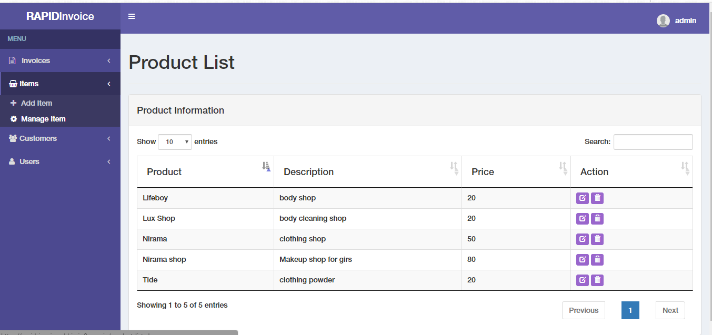
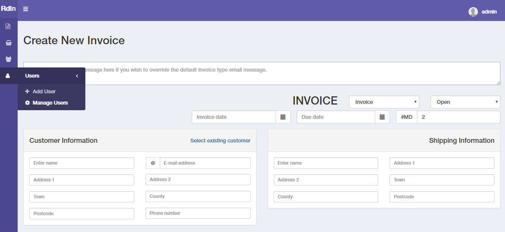

# Rapid Invoice Management System

Rapid Invoice Management system is a fast cloud based invoicing / billing solution. The system enables you to add products and items, create customers and users, and generate as many invoices, receipts and quotes as you want.

The system provides some other awesome features which include instant invoice calculations for items, quantity, discounts, Taxes / VAT and total without any extra effort. I build this app to play with PHP, MYSQL, JQuery and to implement boostrap admin template functionality to the project.

<h2>Screenshots</h2>

<h2>Features</h2>

<ul>
<li>Responsive Designing, easily accessible on different devices.</li>
<li>Generate Invoices and receipts</li>
<li>Unique bill numbers</li>
<li>Functionality to create invoice item each time or choose from database.</li>
<li>Functionality to add and remove TAX.</li>
<li>	Enter shipping details manually or select from database while creating bill</li>
<li>	Send receipts to client's email address</li>
<li>	Generate downloadable PDf and Excel files</li>
<li>	User management: create users to login and use the system</li>
<li> And lot more...</li>
</ul>

<h2>Technology, Tools and Plugin Used</h2>

<ul>
<li>PHP & MySql</li>
<li>Boostrap</li>
<li>JQuery</li>
<li>PHPMailer</li>
<li>TimePicker</li>
<li>ColorPicker</li>
<li>fpdf: To generate Pdf files</li>
</ul>

<h2>Requirements to run the project</h2>
<ul>
<li>PHP 5.0+</li>
<li>MYSQL Database</li>
</ul>

<h2>Setup</h2>

<ul>
<li>Clone the repository to your system</li>
<li>Upload the all files to your web hosting via FTP on your online file manager</li>
<li>Change folder permissions to 0777</li>
<li>Setup / Create your database, user and password in mysql / phpmyadmin or your hosting control panel</li>
<li>Import the setup.sql file from the folder to the database</li>
<li>Open "includes/config.php" and configure the file with database</li>
<li>Enter the default login details, username: admin - password: admin</li>
<li>That's it. Enjoy the system for free.</li>
</ul>

<h2>Credits</h2>
<li>http://www.fpdf.org/</li>
<li>https://almsaeedstudio.com/</li>

<h2>Note</h2>
This invoice system can be used for any type of invoicing from general in-house invoicing, e-commerce, to product and services invoicing. However, System may contain bugs. Feel free to report. And fork the repository to play and add some more functionality.
 
